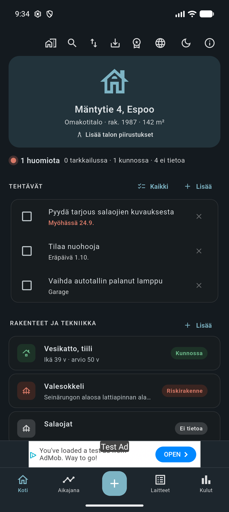
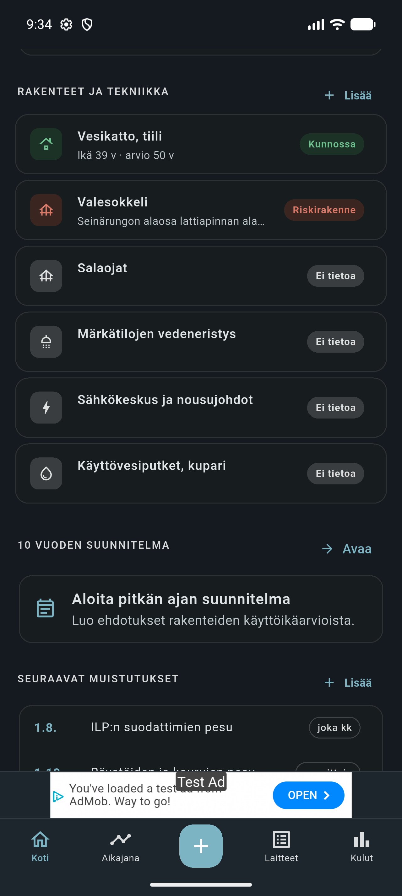
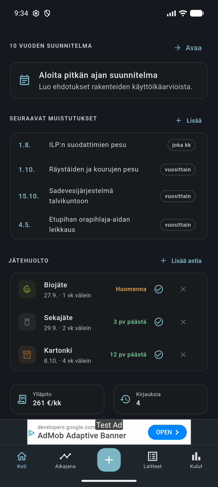
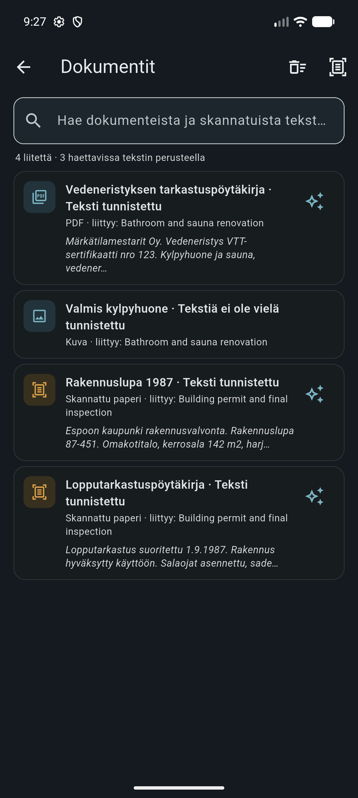
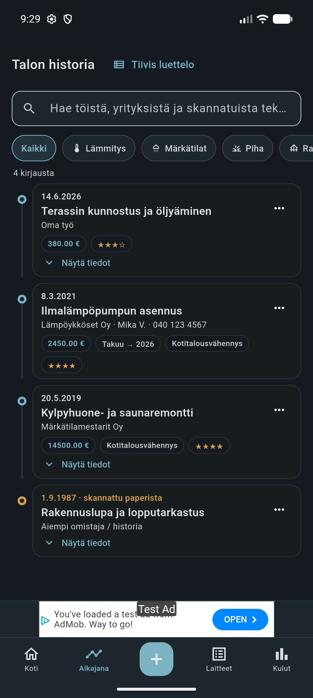
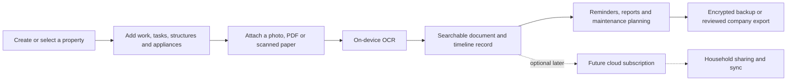

# Kiinteistöpito

  

  A local-first property maintenance logbook built with Flutter. 
  It turns scattered records, receipts and old paper documents into a searchable history of a home.

## The problem

Homeowners often inherit a fragmented property history. Renovations live in email, invoices sit in folders, maintenance tasks are remembered informally, and older work may only exist on paper. When a problem appears or ownership changes, answering basic questions can take hours: What was repaired, who did it, what did it cost, and where is the document?

## The solution

Kiinteistöpito brings the property lifecycle into one mobile app. It stores the user's data locally by default, records work on a chronological timeline, accepts photos and documents, and performs OCR on the device so scanned text becomes searchable. Property structures, reminders, appliances, recurring costs and long-term maintenance planning share the same property-scoped data model.

The product is designed around a free local-first experience. Production cloud sharing and subscription billing are planned premium services and are clearly separated from what currently works offline.

## Product tour

All screenshots below are captures from the Android emulator using fictional demo data bundled with the app.

### Configurable property dashboard

The card layout combines immediate tasks with structure condition, reminders, waste collection and recurring costs. The same content can also be shown as a compact catalogue or a two-column section dashboard.

<table>
  <tr>
    <td></td>
    <td></td>
    <td></td>
  </tr>
</table>

### Searchable OCR document archive

Images and PDF pages are processed locally. Recognised text is indexed for search and stays linked to the original timeline entry.

  

### Property history on a timeline

Entries can include an exact or approximate date, performer, contractor, cost, warranty, tax-deduction status, quality rating, notes and attachments.

  

## Main features

- Local multi-property management with property-scoped records
- Renovation and maintenance timeline with rich structured details
- Camera, gallery, PDF and general file attachments
- Offline image and scanned-PDF OCR with searchable text
- Reviewable OCR suggestions for work-entry fields
- Year-only, month/year and exact dates, each with an optional estimated flag
- Building structures, condition states and editable service-life estimates
- Rule-based 10-year maintenance planning and PDF property reports
- Tasks, recurring maintenance reminders and local notifications
- Appliances, warranties, waste schedules and recurring property costs
- Completed-task recovery and a 30-day trash for deleted records
- Company-ready text export with user-selected property and history fields
- Complete ZIP backup and restore, with optional password encryption
- Finnish and English UI, light and dark themes, scalable text
- Card, compact-list and two-column dashboard layouts

## Typical workflow

## Engineering approach

| Area | Approach |
|---|---|
| Client | Flutter and Dart for an Android/iOS codebase, with a web preview fallback |
| State | A property-scoped application model serialised as versioned JSON snapshots |
| Persistence | Durable local snapshot generations, app-owned attachment files and SQLite FTS indexing |
| OCR | Google ML Kit text recognition performed on the device, including scanned PDF pages |
| Documents | `pdfrx` for PDF handling and the `pdf` package for generated reports |
| Recovery | Validated ZIP import/export, checksums, restore checkpoints and optional password encryption |
| Native services | File and image pickers, notifications, secure storage, ads and in-app purchase adapters |
| Quality | Unit, widget, layout, persistence, native integration and release-build checks |

## Future work

- Deploy and test the production cloud backend, storage policies and account lifecycle
- Configure real store products, server verification, production signing and purchase restoration
- Complete live Google Play and App Store acceptance testing
- Add household sharing
